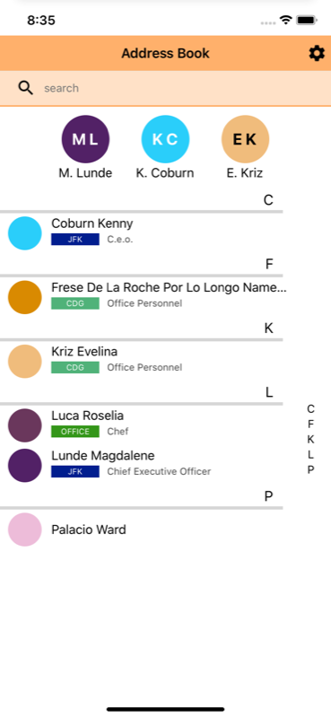
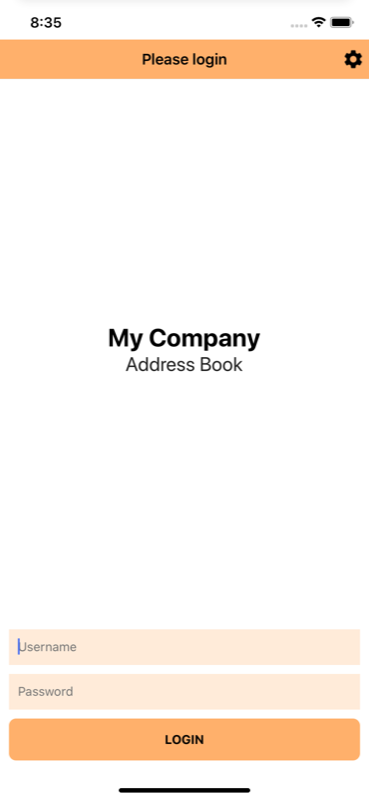

About
===

**[AppaAddressBook] is an **Address Book app that synchronizes contacts using a custom API server**.  
It is **useful for companies or associations** that's want to share contacts using a unique application. They just have to build their own server that provides the contact list and eventually an authentication method, then the server url can be shared with people engaged and used in this app. A test server is provided at the address https://appdressbookapisample.herokuapp.com/ API routes at https://appdressbookapisample.herokuapp.com/api.   

## Screenshot

## RESTful API server
The specification documents to build a **RESTful API server** that works with this application can be found in the "docs/API docs" folder.

## Requirements
* Android minSdkVersion = 16
* iOS Deployment Target = 9.0
